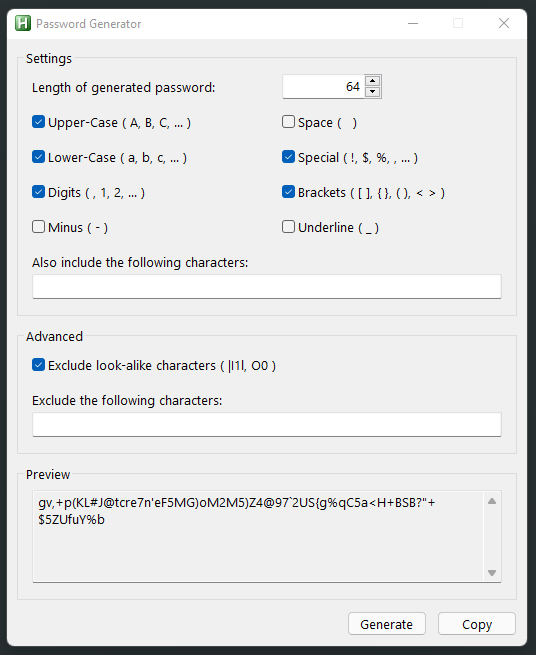

# Password Generator (written in AutoHotkey)

## Features
* Uppercase characters
* Lowercase characters
* Digits (Numbers)
* Minus (-)
* Space ( )
* Underline (_)
* Brackets characters
* Special characters
* Include own characters
* Exclude look-alike characters
* Exclude own characters

## Examples

## Contributing
* thanks to AutoHotkey Community

## Inspired by
[KeePass](https://keepass.info/) Password Generator by Dominik Reichl

## Questions / Bugs / Issues
If you notice any kind of bugs or issues, report them on the [AHK Thread](https://www.autohotkey.com/boards/viewtopic.php?t=95321). Same for any kind of questions.

## Copyright and License
[MIT License](LICENSE)

## Donations
[Donations are appreciated if I could help you](https://www.paypal.me/smithz)